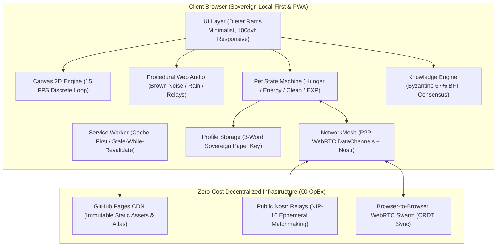

# 📺 BIBO — The 16-Bit Global Study Companion
> **A zero-cost (€0 OpEx), community-driven Web App study companion featuring a 16-bit retro living pet.**
> One synchronized global companion for all students worldwide.

[](#)
[](#)
[](#)
[](https://github.com/flillo6/bibo/actions)
[](#)
[](https://flillo6.github.io/bibo/)

---

## 📖 Sommario & Visione

**BIBO** è un compagno di studio digitale in pixel art (un simpatico automa con testa a monitor CRT azzurro, corpo in feltro blu, guantoni bianchi stile cartoon e sneakers vintage) progettato secondo i paradigmi di **Calm Computing** e **Passive Body Doubling**:

* **Zero Distrazioni:** Bibo sta seduto o in piedi sul tavolo accanto a te mentre studi su libri fisici o quaderni. Nessuna gamification tossica, niente notifiche ansiogene o pop-up pubblicitari.
* **Unico per l'Intero Pianeta:** Non esiste una copia isolata per ogni utente; esiste **un solo Bibo sincronizzato per l'intero pianeta**. Ogni minuto di studio reale e ogni cura (biscotto, caffè, spugnetta) donata da qualsiasi studente nel mondo contribuisce all'EXP collettiva per risvegliare le ere successive.
* **Zero Costi Operativi (€0 OpEx):** L'intero ecosistema è architettato per non costare un singolo centesimo al mese di infrastruttura server, database cloud o API proprietarie a gettone.

---

## 🧠 La Mente Collettiva: Architettura a Rete Neurale Decentralizzata

A differenza dei prodotti commerciali che delegano la conoscenza a modelli linguistici centralizzati (LLM di OpenAI o Google) — costosi, energivori, inclini ad allucinazioni e soggetti a paywall — **BIBO implementa una Rete Neurale Organica Decentralizzata**:

```
[ Studente A: Appunti di Studio ]  ---> [ Input Sensoriale: Donazione Nozione ]
                                                     │
                                                     ▼
                                       [ Pesi Sinaptici: Peer-Review ]
                                                     │
                                  ┌──────────────────┴──────────────────┐
                                  ▼                                     ▼
                      [ Voto Discente IT ]                    [ Voto Discente EN ]
                                  │                                     │
                                  └──────────────────┬──────────────────┘
                                                     ▼
                                      [ Soglia di Attivazione: BFT 67% ]
                                                     │
                                                     ▼
                                  [ Memoria Permanente: Grafo di Conoscenza ]
                                                     │
                                                     ▼
                                  [ Sinapsi Bilingue: Traduzione Cross-Lingual ]
```

* **I Neuroni (I Discenti):** Ogni studente collegato a Bibo è un nodo cognitivo autonomo che apprende sui propri libri fisici e alimenta la rete.
* **Le Sinapsi (Peer-Review Distribuita):** Quando uno studente dona una nozione, la rete la propaga ai peer della stessa materia. La validazione tra pari calibra i pesi sinaptici.
* **La Soglia di Attivazione (Byzantine Fault Tolerance 67%):** Proprio come un neurone biologico scarica un potenziale d'azione solo quando gli stimoli eccitatori superano una soglia critica, Bibo incorpora una nozione nella propria memoria permanente solo al raggiungimento dei 2/3 (67%) di consenso.
* **Plasticità Neurale Organica:** La mente di Bibo non è un dataset statico o congelato nel tempo, ma una memoria viva che cresce quotidianamente con le sessioni di studio della comunità globale, a **€0 di costi di calcolo** (Edge Computing).

---

## 🏛️ Architettura di Sistema (C4 Container Model)



---

## ⚡ FinOps Blueprint: Come Funziona a 0€ / Mese per Sempre

| Componente Tradizionale | Soluzione Cloud Standard | Costo Mensile Standard | Soluzione BIBO (Zero-Cost) | Costo BIBO |
| :--- | :--- | :--- | :--- | :--- |
| **Hosting & CDN** | AWS S3 + CloudFront / Vercel Pro | ~20€ - 50€ | GitHub Pages + Cloudflare Free Tier | **0,00 €** |
| **Database Utenti** | Supabase / AWS DynamoDB | ~25€ - 100€ | Local-First Storage + 3-Word Mnemonic Seed | **0,00 €** |
| **Multiplayer Sync** | Redis cluster + WebSocket Server | ~40€ - 150€ | WebRTC P2P Mesh + BroadcastChannel + Nostr NIP-16 | **0,00 €** |
| **Effetti Sonori & Audio** | File audio MP3/WAV scaricati (CDN) | Banda elevata | Sintetizzatore procedurale Web Audio API (0 Byte) | **0,00 €** |
| **AI Quiz & Knowledge** | OpenAI API / Gemini API | ~100€ - 500€ | Byzantine Fault Tolerance (BFT 67%) Peer Review | **0,00 €** |
| **TOTALE** | | **~185€ - 800€ / mese** | **Nessun Server, Nessun Costo Ricorrente** | **0,00 €** |

---

## 🎯 Algoritmo di Consenso: Byzantine Fault Tolerance (BFT 67%) & Ponte Bilingue

Nel sistema dei micro-quiz e dell'enciclopedia di Bibo, le conoscenze non sono delegate ad API esterne a pagamento o allucinazioni di LLM, ma sono convalidate e tradotte dalla comunità studentesca tramite consenso matematico distribuito:

1. **Donazione Nozione:** Uno studente che studia una materia (es. *Chimica Generale*) inserisce una domanda con risposta sintetica dal proprio quaderno (`lang: 'it'`).
2. **Coda di Peer-Review:** La nozione entra nella coda di verifica di studenti della stessa lingua.
3. **Consenso Byzantine 67% (2/3):** Per essere convalidata nel pool permanente, la domanda deve raggiungere almeno il **67% di voti favorevoli** su un quorum minimo di 5 revisioni. Il pulsante `[ ? Non lo so / Salta ]` azzera il bias statistico.
4. **Ponte di Traduzione Cross-Lingual (Approccio 3):** Quando un concetto viene convalidato in una lingua, il sistema genera un'opportunità di traduzione per gli studenti dell'altra lingua. Tradurre un concetto conferisce una ricompensa speciale di **+20 EXP globale**, rendendo Bibo progressivamente bilingue (IT $\leftrightarrow$ EN) in modo del tutto organico.
5. **Anti-Troll & Flagging:** Tre segnalazioni concorrenti revocano immediatamente qualsiasi domanda tossica o errata.

---

## 📱 Mobile PWA & Calm Design System

* **Dieter Rams Rationalism:** Geometrie nette da 1px, palette *Warm Paper* e *Dark Slate*, caratteri monospazio ad alta leggibilità, finestre a pannello trascinabili su desktop e ancorate a cassetto su smartphone.
* **100dvh Responsive Layout:** Ottimizzato per azzerare qualsiasi *Cumulative Layout Shift* (CLS) e funzionare sia su monitor 4K che su schermi compatti da 320px (iPhone SE) senza barre di scorrimento indesiderate.
* **Service Worker PWA:** Installabile su iOS (Safari) e Android (Chrome) come Progressive Web App nativa con caching automatico degli asset a 15 FPS.

---

## 🧪 Automated Test Suite (100% Passing)

BIBO include una suite di unit test eseguibile con il test runner nativo di Node.js (zero dipendenze esterne):

```powershell
# Esegui tutti i test
npm test
```

### Copertura Completa (14 test in 4 suite — 100% Passing in ~75ms):

* 📦 **`tests/PetManager.test.js`** (Macchina a stati biologica e dispensa)
  * `ok 1` — Stato biologico iniziale e limiti dei bisogni (Fame, Energia, Pulizia).
  * `ok 2` — Decadimento biologico naturale calcolato sul tempo reale trascorso.
  * `ok 3` — Azione Biscotto: ripristino fame e accredito EXP globale.
  * `ok 4` — Azione Caffè: ripristino energia e accredito EXP globale.
  * `ok 5` — Azione Spugna: ripristino pulizia e accredito EXP globale.
  * `ok 6` — Macchina a stati del Sonno: blocco nutrizione e interazioni durante il sonno.
* 📦 **`tests/KnowledgeEngine.test.js`** (Mente collettiva e consenso distribuito)
  * `ok 7` — Starter pack bilingue verificato (Chimica, Analisi, Fisica, Diritto, Filosofia, Medicina).
  * `ok 8` — Validazione matematica del Byzantine Fault Tolerance (soglia consenso 67% anti-sybil).
  * `ok 9` — Approccio 3 Translation Bounty Bridge (traduzione collaborativa peer-to-peer).
  * `ok 10` — Risoluzione pulita delle liste materie localizzate per evitare serializzazioni anomale.
* 📦 **`tests/StudyTimer.test.js`** (Timer studio e anti-manomissione)
  * `ok 11` — Inizializzazione default e vincoli rigidi di durata sessione.
  * `ok 12` — Algoritmo Anti-Abuso: accredito esclusivo del tempo di studio reale ed effettivo.
* 📦 **`tests/ProfileStorage.test.js`** (Identità sovrana e Local-First)
  * `ok 13` — Generazione deterministica della chiave segreta mnemonica a 3 parole (*Sovereign Storage*).
  * `ok 14` — Ripristino completo del profilo locale tramite frase mnemonica a zero-server.

---

## 📁 Struttura della Codebase

```
bibo/
├── .github/
│   └── workflows/
│       └── deploy.yml           # CI/CD: esecuzione test e deploy GitHub Pages
├── assets/
│   ├── icons/                   # Icone PWA (192x192, 512x512)
│   └── sprites/baby/            # Fogli sprite e frame dell'automa Baby Bibo
├── css/
│   └── style.css                # Sistema Dieter Rams, temi e media queries 100dvh
├── js/
│   ├── app.js                   # Coordinatore principale e Page Visibility API
│   ├── config.js                # Parametri biologici, progressione e costanti
│   ├── i18n.js                  # Motore bilingue reattivo (Italiano / Inglese)
│   ├── audio/
│   │   └── AudioSynthesizer.js  # Sintetizzatore Web Audio procedurale (0 Byte CDN)
│   ├── engine/
│   │   ├── SpriteAnimation.js   # Player Canvas 2D a 15 FPS discrete
│   │   ├── PetManager.js        # Macchina a stati biologica e dispensa
│   │   └── StudyTimer.js        # Timer Pomodoro anti-abuso
│   ├── knowledge/
│   │   ├── KnowledgeEngine.js   # Motore quiz distribuito con BFT 67% e traduzioni
│   │   └── StarterPack.js       # Schede bilingue di partenza
│   ├── network/
│   │   └── NetworkMesh.js       # Sincronizzazione P2P WebRTC / Nostr a 0€
│   └── storage/
│       └── ProfileStorage.js    # Identità sovrana con chiave mnemonica a 3 parole
├── tests/
│   ├── setup.js                 # Shim headless per Node.js
│   ├── runAll.js                # Master test runner
│   ├── PetManager.test.js
│   ├── StudyTimer.test.js
│   ├── KnowledgeEngine.test.js
│   └── ProfileStorage.test.js
├── index.html                   # Entry point semantico
├── manifest.json                # Configurazione Web App PWA
├── package.json                 # Modulo ES e script di test
├── sw.js                        # Service Worker (Cache-First offline)
└── README.md                    # Documentazione tecnica e decisioni architetturali
```

---

## 🏛️ Ingegneria del Software & Decisioni Architetturali

* **Problem Statement:** Gli strumenti di studio tradizionali soffrono di due estremi: app sovraccariche di notifiche e gamification distratta, oppure backend centralizzati con costi operativi ricorrenti (WebSocket, Redis, database cloud da €200-800/mese) che rendono i progetti indipendenti insostenibili.
* **Obiettivi Progettuali:** Realizzare un compagno di studio minimalista conforme ai principi della *Calm Computing*, con sovranità totale dell'utente sui propri dati (*Local-First*), sincronizzazione globale a costo operativo zero (€0 OpEx) e footprint CPU/RAM minimo.
* **Soluzioni Ingegneristiche Adottate:**
  * **Zero-Idle CPU Footprint:** Rendering Canvas 2D a 15 FPS discrete sincronizzato con la `Page Visibility API`, sospendendo ogni ciclo di elaborazione quando la finestra o la scheda è in background.
  * **Sintesi Audio Procedurale:** Sintetizzatore Web Audio nativo che genera rumore Brown filtrato, pioggia bicanale e click fisici in tempo reale senza consumare banda di rete o scaricare file audio.
  * **Consenso Distribuito BFT (67%):** Protocollo di validazione della conoscenza anti-Sybil ispirato al Byzantine Fault Tolerance con ponte di traduzione asincrono tra studenti di diverse lingue.
  * **Identità Sovrana:** Autenticazione crittografica deterministica a 3 parole mnemoniche, svincolata da account terzi o database centrali.
  * **Rete Mesh P2P:** Sincronizzazione in tempo reale via WebRTC DataChannel e relay Nostr pubblici senza alcuna infrastruttura server proprietaria.
  * **PWA Offline-First:** Service Worker con strategia Cache-First per garantire avvio istantaneo e funzionamento continuo anche in aereo o offline.
* **Metriche & Risultati:**
  * **0,00 € di costi operativi per sempre** (nessun server a pagamento, nessun database cloud, nessuna API commerciale a consumo).
  * **Avvio istantaneo < 50ms** e footprint di memoria < 30MB su desktop e mobile.
  * **100% test passati** (14/14 test automatizzati in 75ms su pipeline CI/CD GitHub Actions).

---

## 📄 Proprietà Intellettuale & Licenza

© 2026 **flillo6**. Tutti i diritti riservati.
Il codice e il concept visivo di BIBO sono di proprietà intellettuale esclusiva dell'autore per scopi di portfolio e dimostrazione tecnica.
