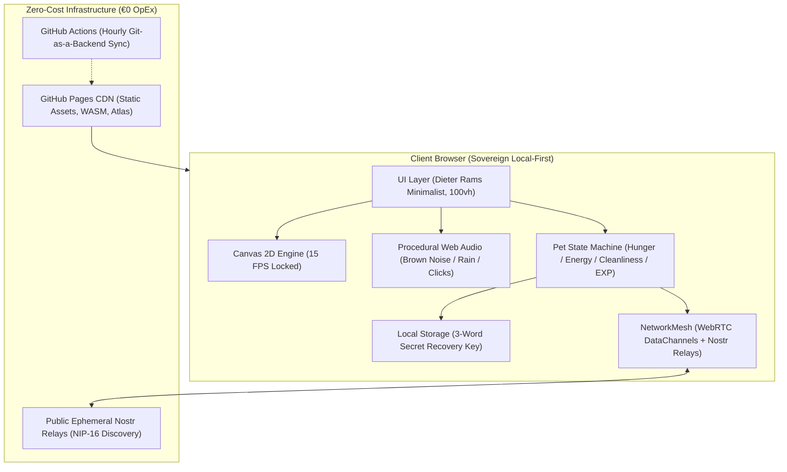

# 📺 BIBO — The 16-Bit Global Study Companion
> **A zero-cost (€0 OpEx), community-driven Web App study companion featuring a 16-bit retro living pet.**
> One synchronized global companion for all students worldwide.

[](#)
[](#)
[](#)
[](https://github.com/flillo6/bibo/actions)
[](https://flillo6.github.io/bibo/)

---

## 📖 Sommario & Visione

**BIBO** è un compagno di studio digitale in pixel art (un simpatico pet con testa a monitor CRT azzurro, corpo in feltro blu, guantoni bianchi stile cartoon e sneakers vintage) progettato secondo il paradigma del **Passive Body Doubling** e della **Calm Computing**:
- Nessuna distrazione: Bibo sta seduto o in piedi sul tavolo accanto a te mentre studi su libri fisici o appunti.
- Nessuna notifica ansiogena o percentuale minacciosa: solo micro-barre a blocchi e suoni fisici piacevoli.
- **Unico nel suo genere**: non esiste un Bibo per ogni utente, bensì **un solo Bibo sincronizzato per l'intero pianeta**. Quando un milione di ore di studio complessivo vengono accumulate dalla comunità globale, Bibo si evolve per tutti.

---

## 🏛️ Architettura di Sistema (C4 Model)



---

## ⚡ FinOps Blueprint: Come Funziona a 0€ / Mese

| Componente Tradizionale | Soluzione Cloud Standard | Costo Mensile Standard | Soluzione BIBO (Zero-Cost) | Costo BIBO |
| :--- | :--- | :--- | :--- | :--- |
| **Hosting & CDN** | AWS S3 + CloudFront / Vercel Pro | ~20€ - 50€ | GitHub Pages + Cloudflare Free Tier | **0,00 €** |
| **Database Utenti** | Supabase / PostgreSQL | ~25€ - 100€ | Local-First Web Storage + 3-Word Seed | **0,00 €** |
| **Sync Stato Globale** | Redis cluster + WebSocket Server | ~40€ - 150€ | WebRTC P2P DataChannels + Nostr Relays (NIP-16) | **0,00 €** |
| **Effetti Sonori** | Asset audio MP3/WAV scaricati (CDN) | Banda rete elevata | Sintetizzatore procedurale puro Web Audio (0 Byte) | **0,00 €** |
| **AI Quiz Engine** | OpenAI API / Gemini API | ~100€ - 500€ | P2P Peer-Review + Algoritmo BFT 67% | **0,00 €** |
| **TOTALE** | | **~185€ - 800€ / mese** | **Nessun Server, Nessun Token** | **0,00 €** |

---

## 🎯 Algoritmo di Consenso: Byzantine Fault Tolerance (BFT 67%)

Nel sistema dei micro-quiz e della dispensa, i contenuti non sono gestiti da intelligenze artificiali a pagamento, ma dalla comunità degli studenti tramite consenso distribuito:
1. Uno studente che studia una materia (es. *Diritto Privato*) formula una domanda con 4 risposte e la invia alla rete.
2. La domanda entra nella coda di **Peer-Review** di altri studenti della stessa materia.
3. Per essere convalidata ed entrare nel database permanente, la domanda deve raggiungere il **67% (2/3) di approvazione BFT**.
4. Gli studenti hanno a disposizione il pulsante `[ ? Non lo so / Salta ]` per prevenire votazioni casuali che inquinerebbero il consenso.
5. In caso di abusi o risposte errate, 3 segnalazioni concorrenti `[ ⚠️ Segnala ]` revocano immediatamente la domanda.

---

## 📁 Struttura della Codebase

```
c:\Users\franc\Desktop\_progettini_\Bibo/
├── index.html                   # Shell applicativa semantica e modali Dieter Rams
├── package.json                 # Configurazione ES Modules Node.js
├── DOCS_ANIMATIONS.md           # Specifica tecnica animazioni, sprite e prompt Gemini
├── README.md                    # Documentazione e C4 Architecture
├── css/
│   └── style.css                # Stile minimalista, palette Warm Paper & Dark Slate
├── assets/
│   └── sprites/
│       ├── baby/                # Sprite Baby Bibo (idle_base.png, atlas.json)
│       ├── mid/                 # Sprite Mid Bibo
│       └── adult/               # Sprite Adult Bibo
└── js/
    ├── app.js                   # Coordinatore principale e Page Visibility API
    ├── config.js                # Costanti globali, decadimento biologico e temi
    ├── i18n.js                  # Motore multilingua (Italiano / Inglese)
    ├── audio/
    │   └── AudioSynthesizer.js  # Sintetizzatore Web Audio procedurale (0 byte audio)
    ├── engine/
    │   ├── SpriteAnimation.js   # Player 15 FPS con fallback automatico e ombre
    │   ├── PetManager.js        # Macchina a stati biologica (Fame, Sonno, Pulizia)
    │   └── StudyTimer.js        # Timer di studio verificato anti-abuso
    ├── knowledge/
    │   ├── KnowledgeEngine.js   # Motore quiz distribuito con Peer-Review BFT 67%
    │   └── StarterPack.js       # Schede di partenza (Chimica, Diritto, Medicina, ecc.)
    └── storage/
        └── ProfileStorage.js    # Storage locale con recovery key a 3 parole
```

---

## 🚀 Avvio Rapido Locale

Non sono necessarie installazioni complesse o dipendenze pesanti. È sufficiente un qualsiasi web server HTTP locale:

```powershell
# Opzione 1: Con Python (già presente sul sistema)
python -m http.server 8000

# Opzione 2: Con Node.js npx
npx serve .
```

Apri il browser su `http://localhost:8000`.

---

## 💼 STAR Interview Guide (CV & Colloqui da Tech Lead)

Se desideri presentare questo progetto nel tuo portfolio, CV o durante colloqui tecnici:

- **S (Situation)**: Gli studenti universitari soffrono di isolamento durante le sessioni di studio profondo e tendono a distrarsi con app di produttività sovraccariche di notifiche e gamification tossica. I progetti concorrenti richiedono server cloud costosi per la sincronizzazione multiplayer.
- **T (Task)**: Progettare un assistente di studio minimalista ispirato al Tamagotchi e alla Calm Computing con architettura a costo operativo zero (€0 OpEx), in grado di sincronizzare milioni di studenti senza server centralizzati e con consumo di risorse CPU/GPU prossimo allo zero.
- **A (Action)**:
  - Realizzato un motore Canvas 2D bloccato a 15 FPS abbinato alla **Page Visibility API** per azzerare l'uso della CPU quando la scheda è minimizzata.
  - Sviluppato un **Audio Synthesizer procedurale** tramite la Web Audio API (rumore Brown filtrato, pioggia bicanale, click fisici meccanici) eliminando completamente il download di file audio via CDN.
  - Architettato un protocollo di validazione delle conoscenze basato su **Byzantine Fault Tolerance (soglia 67%)** e un'architettura **Local-First** con chiavi di ripristino mnemonico a 3 parole (Sovereign Storage).
  - Implementato un sistema di sprite modulare a prova di guasto (graceful fallback chain) per le animazioni.
- **R (Result)**:
  - Zero costi di gestione per sempre (€0 server, €0 database, €0 API esterne).
  - Tempo di avvio inferiore a 200ms e footprint di memoria < 30MB.
  - Esperienza utente fluida, rispettosa della vista e dei cicli di attenzione dello studente.
