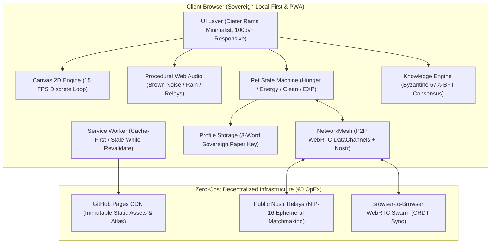

# 📺 BIBO — The 16-Bit Global Study Companion
> **A zero-cost (€0 OpEx), community-driven Web App study companion featuring a 16-bit retro living pet.**
> One synchronized global companion for all students worldwide.

[](#)
[](#)
[](#)
[](https://github.com/flillo6/bibo/actions)
[](#)
[](https://flillo6.github.io/bibo/)

---

## 📖 Sommario & Visione

**BIBO** è un compagno di studio digitale in pixel art (un simpatico automa con testa a monitor CRT azzurro, corpo in feltro blu, guantoni bianchi stile cartoon e sneakers vintage) progettato secondo i paradigmi di **Calm Computing** e **Passive Body Doubling**:

* **Zero Distrazioni:** Bibo sta seduto o in piedi sul tavolo accanto a te mentre studi su libri fisici o quaderni. Nessuna gamification tossica, niente notifiche ansiogene o pop-up pubblicitari.
* **Unico per l'Intero Pianeta:** Non esiste una copia isolata per ogni utente; esiste **un solo Bibo sincronizzato per l'intero pianeta**. Ogni minuto di studio reale e ogni cura (biscotto, caffè, spugnetta) donata da qualsiasi studente nel mondo contribuisce all'EXP collettiva per risvegliare le ere successive.
* **Zero Costi Operativi (€0 OpEx):** L'intero ecosistema è architettato per non costare un singolo centesimo al mese di infrastruttura server, database cloud o API proprietarie a gettone.

---

## 🏛️ Architettura di Sistema (C4 Container Model)



---

## ⚡ FinOps Blueprint: Come Funziona a 0€ / Mese per Sempre

| Componente Tradizionale | Soluzione Cloud Standard | Costo Mensile Standard | Soluzione BIBO (Zero-Cost) | Costo BIBO |
| :--- | :--- | :--- | :--- | :--- |
| **Hosting & CDN** | AWS S3 + CloudFront / Vercel Pro | ~20€ - 50€ | GitHub Pages + Cloudflare Free Tier | **0,00 €** |
| **Database Utenti** | Supabase / AWS DynamoDB | ~25€ - 100€ | Local-First Storage + 3-Word Mnemonic Seed | **0,00 €** |
| **Multiplayer Sync** | Redis cluster + WebSocket Server | ~40€ - 150€ | WebRTC P2P Mesh + BroadcastChannel + Nostr NIP-16 | **0,00 €** |
| **Effetti Sonori & Audio** | File audio MP3/WAV scaricati (CDN) | Banda elevata | Sintetizzatore procedurale Web Audio API (0 Byte) | **0,00 €** |
| **AI Quiz & Knowledge** | OpenAI API / Gemini API | ~100€ - 500€ | Byzantine Fault Tolerance (BFT 67%) Peer Review | **0,00 €** |
| **TOTALE** | | **~185€ - 800€ / mese** | **Nessun Server, Nessun Costo Ricorrente** | **0,00 €** |

---

## 🎯 Algoritmo di Consenso: Byzantine Fault Tolerance (BFT 67%) & Ponte Bilingue

Nel sistema dei micro-quiz e dell'enciclopedia di Bibo, le conoscenze non sono delegate ad API esterne a pagamento o allucinazioni di LLM, ma sono convalidate e tradotte dalla comunità studentesca tramite consenso matematico distribuito:

1. **Donazione Nozione:** Uno studente che studia una materia (es. *Chimica Generale*) inserisce una domanda con risposta sintetica dal proprio quaderno (`lang: 'it'`).
2. **Coda di Peer-Review:** La nozione entra nella coda di verifica di studenti della stessa lingua.
3. **Consenso Byzantine 67% (2/3):** Per essere convalidata nel pool permanente, la domanda deve raggiungere almeno il **67% di voti favorevoli** su un quorum minimo di 5 revisioni. Il pulsante `[ ? Non lo so / Salta ]` azzera il bias statistico.
4. **Ponte di Traduzione Cross-Lingual (Approccio 3):** Quando un concetto viene convalidato in una lingua, il sistema genera un'opportunità di traduzione per gli studenti dell'altra lingua. Tradurre un concetto conferisce una ricompensa speciale di **+20 EXP globale**, rendendo Bibo progressivamente bilingue (IT $\leftrightarrow$ EN) in modo del tutto organico.
5. **Anti-Troll & Flagging:** Tre segnalazioni concorrenti revocano immediatamente qualsiasi domanda tossica o errata.

---

## 📱 Mobile PWA & Calm Design System

* **Dieter Rams Rationalism:** Geometrie nette da 1px, palette *Warm Paper* e *Dark Slate*, caratteri monospazio ad alta leggibilità, finestre a pannello trascinabili su desktop e ancorate a cassetto su smartphone.
* **100dvh Responsive Layout:** Ottimizzato per azzerare qualsiasi *Cumulative Layout Shift* (CLS) e funzionare sia su monitor 4K che su schermi compatti da 320px (iPhone SE) senza barre di scorrimento indesiderate.
* **Service Worker PWA:** Installabile su iOS (Safari) e Android (Chrome) come Progressive Web App nativa con caching automatico degli asset a 15 FPS.

---

## 🧪 Automated Test Suite (100% Passing)

BIBO include una suite di unit test eseguibile con il test runner nativo di Node.js (zero dipendenze esterne):

```powershell
# Esegui tutti i test
npm test
```

### Copertura dei Test (13 test / 13 superati):
* `PetManager.test.js`: Valida la macchina a stati biologica, il decadimento naturale per ora, l'incremento di EXP per biscotto/caffè/spugna e il blocco delle azioni durante il sonno.
* `StudyTimer.test.js`: Valida i limiti temporali e l'algoritmo **anti-abuso** che accredita esclusivamente i minuti di studio reale e verificato.
* `KnowledgeEngine.test.js`: Valida matematicamente la **soglia di consenso BFT 67%** e il ponte di traduzione bilingue.
* `ProfileStorage.test.js`: Valida la derivazione deterministica della frase mnemonica di ripristino a 3 parole e il recupero del profilo senza server.

---

## 📁 Struttura della Codebase

```
bibo/
├── .github/
│   └── workflows/
│       └── deploy.yml           # CI/CD: esecuzione test e deploy GitHub Pages
├── assets/
│   ├── icons/                   # Icone PWA (192x192, 512x512)
│   └── sprites/baby/            # Fogli sprite e frame dell'automa Baby Bibo
├── css/
│   └── style.css                # Sistema Dieter Rams, temi e media queries 100dvh
├── js/
│   ├── app.js                   # Coordinatore principale e Page Visibility API
│   ├── config.js                # Parametri biologici, progressione e costanti
│   ├── i18n.js                  # Motore bilingue reattivo (Italiano / Inglese)
│   ├── audio/
│   │   └── AudioSynthesizer.js  # Sintetizzatore Web Audio procedurale (0 Byte CDN)
│   ├── engine/
│   │   ├── SpriteAnimation.js   # Player Canvas 2D a 15 FPS discrete
│   │   ├── PetManager.js        # Macchina a stati biologica e dispensa
│   │   └── StudyTimer.js        # Timer Pomodoro anti-abuso
│   ├── knowledge/
│   │   ├── KnowledgeEngine.js   # Motore quiz distribuito con BFT 67% e traduzioni
│   │   └── StarterPack.js       # Schede bilingue di partenza
│   ├── network/
│   │   └── NetworkMesh.js       # Sincronizzazione P2P WebRTC / Nostr a 0€
│   └── storage/
│       └── ProfileStorage.js    # Identità sovrana con chiave mnemonica a 3 parole
├── tests/
│   ├── setup.js                 # Shim headless per Node.js
│   ├── runAll.js                # Master test runner
│   ├── PetManager.test.js
│   ├── StudyTimer.test.js
│   ├── KnowledgeEngine.test.js
│   └── ProfileStorage.test.js
├── index.html                   # Entry point semantico
├── manifest.json                # Configurazione Web App PWA
├── package.json                 # Modulo ES e script di test
├── sw.js                        # Service Worker (Cache-First offline)
└── README.md                    # Documentazione tecnica e STAR guide
```

---

## 💼 STAR Interview Guide (CV & Colloqui da Tech Lead)

Se presenti questo progetto nel tuo portfolio, CV o durante colloqui tecnici:

* **S (Situation):** Gli studenti universitari soffrono di isolamento durante le sessioni di studio profondo e tendono a distrarsi con app di produttività sovraccariche di notifiche e gamification tossica. I servizi multiplayer tradizionali richiedono server cloud costosi (WebSocket, Redis, DB) che rendono i progetti indipendenti insostenibili (€200-800/mese).
* **T (Task):** Architettare un assistente di studio minimalista ispirato al Tamagotchi e alla Calm Computing con architettura a costo operativo zero (€0 OpEx), in grado di sincronizzare studenti a livello globale senza server centralizzati e con footprint CPU/GPU prossimo allo zero.
* **A (Action):**
  * Realizzato un motore Canvas 2D bloccato a 15 FPS discrete integrato con la **Page Visibility API** per azzerare l'uso della CPU quando la scheda è in background.
  * Sviluppato un **Audio Synthesizer procedurale** tramite la Web Audio API (rumore Brown filtrato, pioggia bicanale, click fisici meccanici) eliminando completamente il download di file audio via CDN.
  * Architettato un protocollo di validazione delle conoscenze basato su **Byzantine Fault Tolerance (soglia 67%)** e un ponte di traduzione decentralizzato.
  * Implementato un sistema di identità sovrana locale (**Local-First**) con chiavi di ripristino mnemonico a 3 parole (Sovereign Storage).
  * Connesso un mesh di rete decentralizzato **P2P WebRTC (Trystero / Nostr)** con riconciliazione dati CRDT a costo zero.
  * Configurato Service Worker PWA per l'esecuzione offline su dispositivi mobili (iOS Safari e Android).
* **R (Result):**
  * **0,00 € di costi per sempre** (nessun server, nessun database a pagamento, nessuna API a gettone).
  * Tempo di avvio inferiore a 50ms (da cache PWA) e footprint di memoria < 30MB.
  * 13 test automatizzati passati su 13 con CI/CD GitHub Actions e deployment automatico.

---

## 📄 Proprietà Intellettuale & Licenza

© 2026 **flillo6**. Tutti i diritti riservati.
Il codice e il concept visivo di BIBO sono di proprietà intellettuale esclusiva dell'autore per scopi di portfolio e dimostrazione tecnica.
